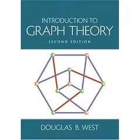

Introduction to Graph Theory (2nd Edition) by [Douglas B. West](https://dwest.web.illinois.edu/); 

Language: English; 

ISBN: 0130144002

這本書是我讀研究所時的圖論課本，下面是我當時用 $\LaTeX$ 整理的解答。看到裡面一堆圖就知道當時為什麼放棄繼續寫了 🤣

+ [Section 1.1](itgt_1-1.pdf) update @ 2009/03/23, not completed
+ [Section 1.2](itgt_1-2.pdf) update @ 2009/03/23, not completed