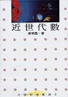

近世代數 by [康明昌](http://www.math.ntu.edu.tw/~kang/); 

Language: Chinese; 

ISBN: 9570821558

康老師是我讀研究所時的代數老師，但因為我太常翹課甚至忘了去考試，所以最後被當了 🤣

+ [第一章習題解答](kang_algebra_1.pdf)。最近更新：2009/03/12
