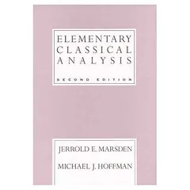

Elementary Classical Analysis (2nd Edition) by [Jerrold E. Marsden](http://www.cds.caltech.edu/~marsden/), Michael J. Hoffman; 

Language: English; 

ISBN: 0716721058

這本書是我大二時的高微課本，下面是我當時研究所畢業時用 $\LaTeX$ 整理的解答。

+ [Chapter 1](eca01.pdf) update @ 2006/07/15
+ [Chapter 2](eca02.pdf) update @ 2006/07/15, not completed
+ [Chapter 3](eca03.pdf) update @ 2006/07/15, not completed